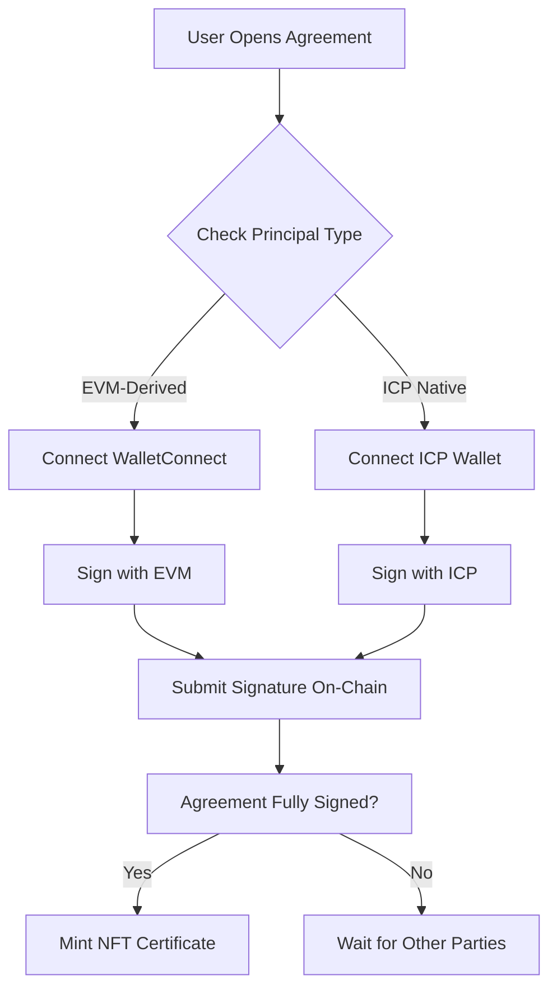

# Attesta

Blockchain-powered legal agreement platform with AI contract generation, multi-chain attestation, and decentralized signatures.

## Overview

Attesta enables users to create, sign, and verify legal agreements on-chain with cryptographic proof. The platform combines:

- **AI Contract Generation**: OpenAI-powered legal document creation
- **Multi-Party Signing**: Support for both EVM and ICP native wallets
- **Blockchain Attestation**: Multi-chain proof via Sign Protocol (EAS)
- **NFT Certificates**: Mint signed agreements as proof certificates
- **Micropayments**: Pay-per-use API endpoints via Thirdweb Nexus (x402)

## Tech Stack

- **Frontend**: Next.js 14 (App Router), TypeScript, TailwindCSS
- **Blockchain**:
  - Sign Protocol (Attestations on Base Sepolia)
  - Thirdweb SDK (Wallet connection & smart contracts)
  - Internet Computer Protocol (ICP native wallets)
- **AI**: OpenAI GPT-4o-mini
- **Payments**: Thirdweb Nexus x402 micropayments
- **Deployment**: Vercel

## Multi-Party Signing Workflow

### 1. Agreement Creation
```
Creator → Generate Agreement (AI) → Add Parties → Deploy On-Chain
```

**Features:**
- Generate legal documents using AI templates (Freelance, Rental, Employment, NDA, etc.)
- Add multiple parties by their principals (EVM or ICP native)
- Store agreement metadata on-chain

### 2. Principal Types

**EVM-Derived Principals:**
- Users connect with WalletConnect (MetaMask, Coinbase, etc.)
- EVM address converted to ICP principal: `addressToPrincipal(evmAddress)`
- Signs with EVM wallet

**ICP Native Principals:**
- Users connect with Plug, Internet Identity, Stoic, etc.
- Direct ICP principal (no conversion needed)
- Signs with ICP wallet

### 3. Signing Flow



### 4. Adding Other Parties

**In Agreement Modal:**
1. Creator generates agreement
2. Adds other parties by entering their principals:
   - EVM: `0x1234...` (auto-converted to principal)
   - ICP: `abc123-xyz...` (direct principal)
3. System validates principal format
4. Agreement deployed with all parties

**When Other Party Signs:**
1. Party receives agreement link or ID
2. Opens agreement
3. System detects their principal type
4. Routes to appropriate wallet:
   - **EVM users** → WalletConnect → Sign with MetaMask/Coinbase
   - **ICP users** → Plug/II/Stoic → Sign with native wallet
5. Signature recorded on-chain
6. When all parties sign → NFT certificate minting available

### 5. Wallet Detection

```typescript
// Automatic wallet detection
if (isEVMDerivedPrincipal(userPrincipal)) {
  // Show WalletConnect option
  connectWalletConnect();
} else {
  // Show ICP wallet options (Plug, II, Stoic)
  showICPWallets();
}
```

### 6. Verification

All signatures are cryptographically verified:
- **EVM signatures**: ECDSA verification
- **ICP signatures**: Ed25519 verification
- **Attestations**: Sign Protocol on-chain verification

## Project Structure

```
frontend/
├── src/
│   ├── app/                    # Next.js App Router
│   │   ├── (public)/          # Public routes
│   │   ├── (protected)/       # Auth-protected routes
│   │   └── api/               # API routes
│   │       ├── ai/            # AI generation endpoints
│   │       └── attestations/  # Blockchain attestation APIs
│   ├── components/
│   │   ├── modals/            # Agreement, signing modals
│   │   └── ui/                # Reusable UI components
│   ├── lib/
│   │   ├── blockchain/        # Wallet & contract logic
│   │   │   └── thirdweb/     # Payment middleware, contracts
│   │   └── utils/             # Helper functions
│   └── hooks/                 # React hooks
├── contracts/                  # Smart contracts
├── public/                     # Static assets
└── multi-party-signing.md     # Implementation guide
```

## Getting Started

### Prerequisites

- Node.js 18+
- pnpm
- OpenAI API Key
- Thirdweb API Key (optional for x402 payments)

### Installation

```bash
# Clone repository
git clone <repo-url>
cd frontend

# Install dependencies
pnpm install

# Copy environment variables
cp .env.example .env.local
```

### Environment Variables

```bash
# OpenAI (Required)
OPENAI_API_KEY=sk-proj-...

# Thirdweb (Optional - for x402 payments)
NEXUS_WALLET_SECRET=...

# Sign Protocol
NEXT_PUBLIC_SIGN_PROTOCOL_CHAIN_ID=84532  # Base Sepolia
```

### Development

```bash
# Run development server
pnpm dev

# Open http://localhost:3000
```

### Deployment

```bash
# Deploy to Vercel
vercel --prod

# Or push to main branch (auto-deploy)
git push origin main
```

**Important:** After adding environment variables in Vercel, trigger a redeploy:
```bash
git commit --allow-empty -m "Trigger redeploy"
git push
```

## Features

### AI Contract Generation
- **Endpoint**: `POST /api/ai/generate`
- **Templates**: Freelance, Rental, Employment, Partnership, NDA, Custom
- **Cost**: $0.10 per generation (via x402)
- **Model**: GPT-4o-mini

### Blockchain Attestations
- **Protocol**: Sign Protocol (EAS)
- **Chain**: Base Sepolia (testnet)
- **Schema**: Custom legal agreement schema
- **Verification**: On-chain cryptographic proof

### Micropayments
- **System**: Thirdweb Nexus x402
- **Network**: Base Sepolia
- **Pricing**:
  - AI Generation: $0.10
  - AI Explanation: $0.05
  - NFT Minting: $0.50
  - Validation: $0.05

### Multi-Wallet Support
- **EVM Wallets**: MetaMask, Coinbase Wallet, WalletConnect
- **ICP Wallets**: Plug, Internet Identity, Stoic
- **Auto-Detection**: Based on principal format

## API Routes

### AI Generation
```typescript
POST /api/ai/generate
{
  "description": "Create a freelance agreement for web development",
  "templateType": "freelance",
  "context": "3-month project, $5000 budget"
}
```

### AI Explanation
```typescript
POST /api/ai/explain
{
  "clause": "The Freelancer shall retain all intellectual property rights..."
}
```

## Security

- **API Key Validation**: Server-side env var checks
- **Payment Verification**: x402 settlement before API access
- **Signature Verification**: Cryptographic validation on-chain
- **Principal Validation**: Format checks before storage
- **Rate Limiting**: Via Vercel edge functions

## Troubleshooting

### OpenAI 500 Error
1. Check API key is complete and valid
2. Verify env var is set in Vercel (all environments)
3. Redeploy after adding env vars
4. Check function logs for key detection

### Wallet Connection Issues
1. Ensure correct network (Base Sepolia)
2. Check wallet has test ETH
3. Clear browser cache/cookies
4. Try different wallet provider

### Signing Failures
1. Verify user is a party to the agreement
2. Check principal matches wallet
3. Ensure correct wallet type (EVM vs ICP)
4. Verify network connection

## Contributing

See `multi-party-signing.md` for implementation details on the multi-party signing feature.

## License

MIT

## Links

- [Thirdweb Nexus Docs](https://nexus.thirdweb.com)
- [Sign Protocol](https://sign.global)
- [OpenAI API](https://platform.openai.com)
- [Internet Computer](https://internetcomputer.org)
