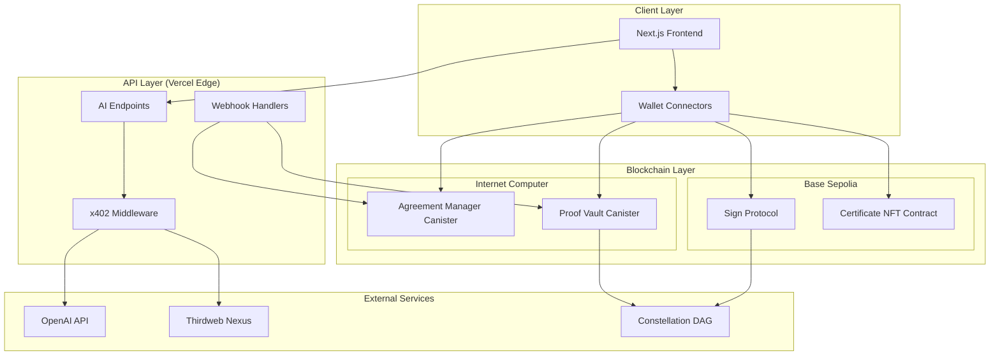
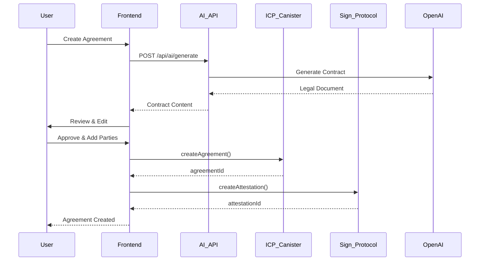
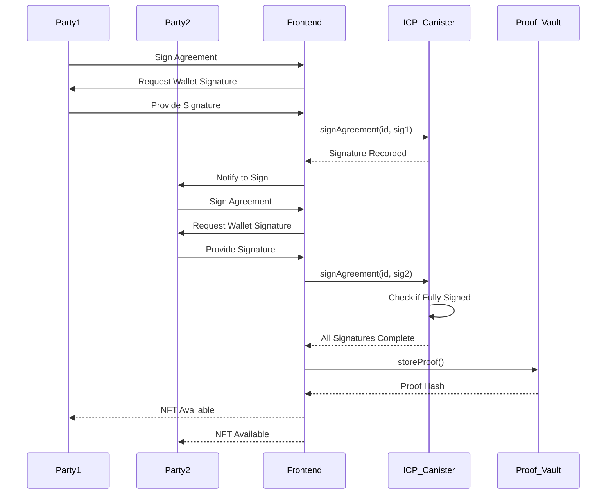
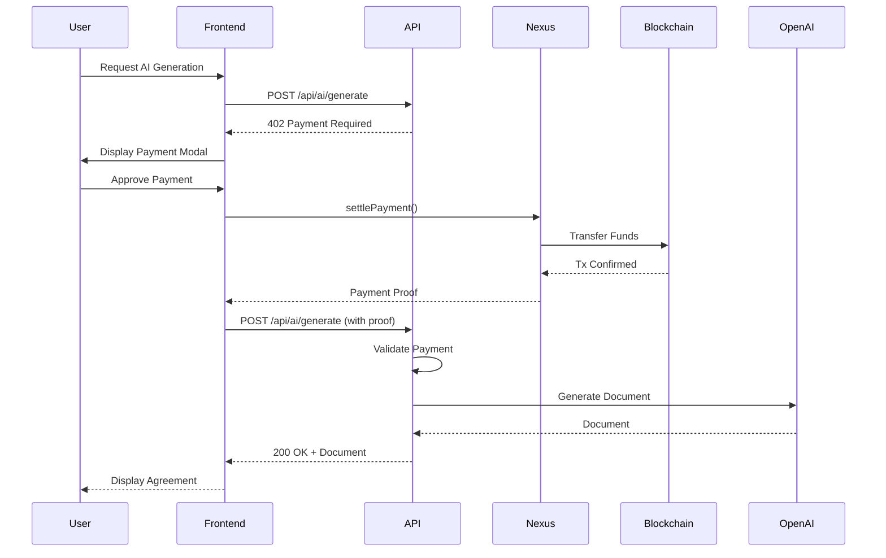

# Attesta Architecture Guide

Complete system architecture and design documentation for the Attesta platform.

## Table of Contents

- [System Overview](#system-overview)
- [Architecture Diagram](#architecture-diagram)
- [Technology Stack](#technology-stack)
- [Frontend Architecture](#frontend-architecture)
- [Backend Architecture](#backend-architecture)
- [Blockchain Integration](#blockchain-integration)
- [Data Flow](#data-flow)
- [Security Architecture](#security-architecture)
- [Deployment Architecture](#deployment-architecture)

---

## System Overview

Attesta is a **hybrid blockchain platform** that combines:

1. **Web2 Frontend**: Next.js application hosted on Vercel
2. **Web3 Backend**: Internet Computer (ICP) canisters for decentralized logic
3. **EVM Integration**: Smart contracts on Base Sepolia for attestations
4. **AI Services**: OpenAI API for legal document generation
5. **Payment Layer**: Thirdweb Nexus x402 micropayments

### Core Components

```
┌─────────────────────────────────────────────────────────────┐
│                       User Interface                        │
│              (Next.js App Router + React)                   │
└─────────────────────────────────────────────────────────────┘
                            │
        ┌───────────────────┼───────────────────┐
        │                   │                   │
        ▼                   ▼                   ▼
┌──────────────┐    ┌──────────────┐    ┌──────────────┐
│ AI Services  │    │   Payment    │    │   Wallet     │
│   (OpenAI)   │    │   (x402)     │    │  Providers   │
└──────────────┘    └──────────────┘    └──────────────┘
                            │                   │
        ┌───────────────────┴───────────────────┘
        │
        ▼
┌─────────────────────────────────────────────────────────────┐
│                    Blockchain Layer                         │
├─────────────────────────────┬───────────────────────────────┤
│   ICP Canisters             │   EVM Smart Contracts         │
│   (Agreement Storage)       │   (Attestations & NFTs)       │
└─────────────────────────────┴───────────────────────────────┘
```

---

## Architecture Diagram



---

## Technology Stack

### Frontend
- **Framework**: Next.js 14 (App Router)
- **Language**: TypeScript
- **Styling**: TailwindCSS
- **State Management**: React Hooks + Context API
- **Wallet Integration**:
  - Reown AppKit (formerly WalletConnect)
  - @dfinity/agent (ICP wallets)

### Backend
- **API Routes**: Next.js API Routes (Edge Functions)
- **Canisters**: Rust/Motoko on Internet Computer
- **Smart Contracts**: Solidity on Base Sepolia

### Blockchain
- **ICP**: Agreement storage & business logic
- **EVM (Base Sepolia)**: Attestations & NFT certificates
- **Attestation**: Sign Protocol (EAS standard)
- **Cross-chain**: Constellation DAG

### AI & Payments
- **AI**: OpenAI GPT-4o-mini
- **Payments**: Thirdweb Nexus x402
- **Payment Network**: Base Sepolia

### DevOps
- **Hosting**: Vercel (Frontend + Edge Functions)
- **Canister Deployment**: dfx (ICP SDK)
- **Contract Deployment**: Hardhat + Thirdweb
- **Version Control**: Git + GitHub

---

## Frontend Architecture

### Directory Structure

```
src/
├── app/                        # Next.js App Router
│   ├── (public)/              # Public routes (landing, about, etc.)
│   ├── (protected)/           # Auth-required routes
│   ├── (auth)/                # Wallet connection pages
│   ├── api/                   # API route handlers
│   │   ├── ai/               # AI endpoints
│   │   └── webhooks/         # Webhook receivers
│   ├── dashboard/            # Dashboard pages
│   │   ├── agreements/       # Agreement management
│   │   ├── certificates/     # NFT certificates
│   │   ├── verify/          # Proof verification
│   │   └── analytics/       # Analytics & reports
│   └── layout.tsx           # Root layout
│
├── components/
│   ├── ui/                   # Reusable UI components
│   ├── layout/              # Layout components (header, footer, sidebar)
│   ├── modals/              # Modal dialogs
│   ├── landing/             # Landing page sections
│   └── payment/             # Payment-related components
│
├── lib/
│   ├── blockchain/          # Blockchain integration
│   │   ├── icp/            # ICP canister clients
│   │   ├── ethereum/       # EVM contract clients
│   │   ├── constellation/  # Cross-chain DAG
│   │   └── thirdweb/       # Payment & wallet
│   ├── services/           # Business logic services
│   ├── hooks/              # React hooks
│   ├── constants/          # Constants & config
│   └── utils/              # Utility functions
│
└── hooks/                   # Additional React hooks
```

### Component Architecture

**Pages** → **Layouts** → **Containers** → **Components** → **UI Primitives**

```typescript
// Page Level (Route Handler)
app/dashboard/agreements/page.tsx
  ↓
// Container Component (Logic & State)
components/agreements/AgreementList.tsx
  ↓
// Presentational Component
components/agreements/AgreementCard.tsx
  ↓
// UI Primitives
components/ui/Card.tsx
```

### State Management

**Global State:**
- Wallet connection: `AppKitProvider` context
- User authentication: `useWallet` hook
- Payment state: `useX402Payment` hook

**Local State:**
- Component state: React `useState`
- Form state: React Hook Form
- Server state: TanStack Query (if needed)

**Example:**
```typescript
// Global wallet state
const { address, principal, isConnected } = useWallet();

// Local component state
const [agreements, setAgreements] = useState<Agreement[]>([]);

// Server state with caching
const { data, isLoading } = useAgreementData(agreementId);
```

### Routing

Using Next.js App Router with:
- **File-based routing**: `app/dashboard/page.tsx` → `/dashboard`
- **Dynamic routes**: `app/agreements/[id]/page.tsx` → `/agreements/123`
- **Route groups**: `app/(public)/` for layout grouping
- **Parallel routes**: For modals and sidebars

---

## Backend Architecture

### API Routes (Edge Functions)

All API routes run as **Vercel Edge Functions** (low latency, serverless).

```typescript
// src/app/api/ai/generate/route.ts
export const POST = withOptionalX402Payment(
  async (request: NextRequest) => {
    // Handler logic
    const openai = new OpenAI({ apiKey: process.env.OPENAI_API_KEY });
    const response = await openai.chat.completions.create({...});
    return NextResponse.json({ content: response.content });
  },
  { endpoint: "AI_GENERATION" }
);
```

### ICP Canisters

**Agreement Manager Canister:**
- **Purpose**: Store and manage legal agreements
- **Language**: Rust (can be Motoko)
- **Storage**: Stable memory for persistence
- **Methods**: CRUD operations on agreements

**Proof Vault Canister:**
- **Purpose**: Store cryptographic proofs and attestations
- **Language**: Rust
- **Storage**: Stable memory
- **Methods**: Store, retrieve, verify proofs

**Canister Interface:**
```candid
// agreement_manager.did
service : {
  createAgreement : (text, text, vec principal, AgreementMetadata) -> (Result_1);
  getAgreement : (nat64) -> (opt Agreement) query;
  signAgreement : (nat64, blob) -> (Result_2);
  getUserAgreements : (principal) -> (vec Agreement) query;
}
```

### Smart Contracts (EVM)

**Sign Protocol Schema:**
- **Chain**: Base Sepolia
- **Purpose**: On-chain attestations for agreements
- **Standard**: Ethereum Attestation Service (EAS)

**Certificate NFT Contract:**
- **Standard**: ERC-721
- **Purpose**: Mint proof certificates as NFTs
- **Features**: Soulbound (non-transferable) option

```solidity
// AttestaCertificate.sol
contract AttestaCertificate is ERC721 {
    struct Certificate {
        uint256 agreementId;
        bytes32 proofHash;
        address[] signers;
        uint256 timestamp;
    }

    mapping(uint256 => Certificate) public certificates;

    function mint(
        uint256 agreementId,
        bytes32 proofHash,
        address[] memory signers
    ) external returns (uint256 tokenId) {
        // Minting logic
    }
}
```

---

## Blockchain Integration

### Multi-Chain Architecture

Attesta operates on **two blockchain networks**:

1. **Internet Computer (ICP)**
   - **Role**: Primary data storage and business logic
   - **Reason**: Decentralized, low-cost storage
   - **Data**: Agreement content, signatures, metadata

2. **Base Sepolia (EVM)**
   - **Role**: Attestations and NFT certificates
   - **Reason**: EVM compatibility, EAS standard support
   - **Data**: Cryptographic proofs, attestation IDs

### Cross-Chain Communication

**Constellation DAG** bridges ICP and EVM:

```
ICP Canister → Generate Proof → Constellation DAG
                                       ↓
                              Validate Across Chains
                                       ↓
Base Sepolia ← Create Attestation ← Constellation DAG
```

### Wallet Abstraction Layer

```typescript
// lib/blockchain/wallet-provider.tsx
interface WalletProvider {
  type: 'EVM' | 'ICP_NATIVE';
  connect(): Promise<string>;
  disconnect(): Promise<void>;
  signMessage(message: string): Promise<Signature>;
  getPrincipal(): Promise<Principal>;
}

class EVMWalletProvider implements WalletProvider {
  type = 'EVM';

  async connect() {
    const address = await connectEVM();
    return addressToPrincipal(address); // Convert to ICP principal
  }

  async signMessage(message: string) {
    return await signWithEVM(message);
  }
}

class ICPWalletProvider implements WalletProvider {
  type = 'ICP_NATIVE';

  async connect() {
    const identity = await window.ic.plug.requestConnect();
    return identity.getPrincipal().toText();
  }

  async signMessage(message: string) {
    return await window.ic.plug.signMessage(message);
  }
}
```

### Address Conversion (EVM ↔ ICP)

```typescript
// lib/blockchain/icp/address-converter.ts
import { Principal } from '@dfinity/principal';
import { sha224 } from 'js-sha256';

export function addressToPrincipal(address: string): Principal {
  // Remove 0x prefix
  const addr = address.toLowerCase().replace('0x', '');

  // Hash the address
  const hash = sha224(Buffer.from(addr, 'hex'));

  // Convert to Principal
  return Principal.fromUint8Array(Buffer.from(hash, 'hex').slice(0, 29));
}

export function principalToAddress(principal: Principal): string {
  // Reverse conversion (if possible)
  // Note: This is one-way, so we store original address in metadata
  throw new Error('Cannot reverse principal to address');
}
```

---

## Data Flow

### Agreement Creation Flow



### Multi-Party Signing Flow



### Payment Flow (x402)



---

## Security Architecture

### Authentication

**Wallet-Based Auth:**
- No traditional username/password
- User identity = blockchain principal/address
- Signature-based authentication

**Session Management:**
```typescript
// Verify user owns wallet
const message = `Sign this message to authenticate: ${Date.now()}`;
const signature = await wallet.signMessage(message);
const recovered = recoverAddress(message, signature);

if (recovered === userAddress) {
  // Create session
  const session = createSession(userAddress);
}
```

### Authorization

**On-Chain Permissions:**
- Only agreement parties can sign
- Only agreement creator can add parties (initially)
- Only NFT owner can transfer certificate

**Canister-Level:**
```rust
// Rust canister authorization
fn sign_agreement(agreement_id: u64, signature: Vec<u8>) -> Result<(), String> {
    let caller = ic_cdk::caller();
    let agreement = get_agreement(agreement_id)?;

    if !agreement.parties.contains(&caller) {
        return Err("Unauthorized: Not a party to this agreement".to_string());
    }

    // Proceed with signature
    Ok(())
}
```

### Data Security

**Encryption:**
- **At Rest**: ICP stable memory (encrypted by default)
- **In Transit**: HTTPS/TLS for all connections
- **On Chain**: Public data (agreements are publicly verifiable)

**Private Data:**
- Sensitive clauses can be hashed (only hash stored on-chain)
- Full document stored off-chain or in encrypted form
- Parties receive decryption keys upon signing

### API Security

**Rate Limiting:**
```typescript
// Vercel rate limiting
import { Ratelimit } from '@upstash/ratelimit';

const ratelimit = new Ratelimit({
  redis: Redis.fromEnv(),
  limiter: Ratelimit.slidingWindow(10, '1 m'),
});

export async function POST(request: Request) {
  const ip = request.headers.get('x-forwarded-for');
  const { success } = await ratelimit.limit(ip);

  if (!success) {
    return NextResponse.json({ error: 'Rate limit exceeded' }, { status: 429 });
  }

  // Handle request
}
```

**Input Validation:**
```typescript
import { z } from 'zod';

const agreementSchema = z.object({
  title: z.string().min(1).max(200),
  content: z.string().min(10).max(50000),
  parties: z.array(z.string()).min(2).max(10),
});

const input = agreementSchema.parse(request.body);
```

### Smart Contract Security

**Audited Contracts:**
- Sign Protocol (EAS) - audited by OpenZeppelin
- Thirdweb contracts - audited

**Access Control:**
```solidity
modifier onlyParty(uint256 agreementId) {
    require(isParty[agreementId][msg.sender], "Not a party");
    _;
}

function signAgreement(uint256 agreementId) external onlyParty(agreementId) {
    // Signing logic
}
```

---

## Deployment Architecture

### Infrastructure

```
┌─────────────────────────────────────────────────────────┐
│                       Cloudflare                        │
│                    (DNS + CDN)                          │
└─────────────────────────────────────────────────────────┘
                          │
                          ▼
┌─────────────────────────────────────────────────────────┐
│                    Vercel Edge Network                  │
│  ┌──────────────┐  ┌──────────────┐  ┌──────────────┐ │
│  │  Next.js App │  │ Edge Functions│  │  Static Assets│ │
│  └──────────────┘  └──────────────┘  └──────────────┘ │
└─────────────────────────────────────────────────────────┘
          │                    │                  │
          ▼                    ▼                  ▼
┌──────────────┐    ┌──────────────┐    ┌──────────────┐
│ ICP Canisters│    │ Base Sepolia │    │   OpenAI     │
│  (Mainnet)   │    │   (Testnet)  │    │     API      │
└──────────────┘    └──────────────┘    └──────────────┘
```

### Environments

**Development:**
- **Frontend**: `localhost:3000`
- **Canisters**: Local replica (`dfx start`)
- **Blockchain**: Hardhat local network
- **Payments**: Disabled (x402 bypass)

**Staging:**
- **Frontend**: `staging.attesta.app`
- **Canisters**: ICP testnet
- **Blockchain**: Base Sepolia testnet
- **Payments**: Enabled (testnet)

**Production:**
- **Frontend**: `attesta.app`
- **Canisters**: ICP mainnet
- **Blockchain**: Base mainnet
- **Payments**: Enabled (mainnet)

### Deployment Pipeline

```
Developer → Git Push → GitHub
                         ↓
                  GitHub Actions
                         ↓
              ┌──────────┴──────────┐
              ▼                     ▼
        Vercel Deploy         dfx deploy
         (Frontend)           (Canisters)
              ↓                     ↓
        Edge Functions     ICP Mainnet
```

**CI/CD Workflow:**
```yaml
# .github/workflows/deploy.yml
name: Deploy

on:
  push:
    branches: [main]

jobs:
  deploy-frontend:
    runs-on: ubuntu-latest
    steps:
      - uses: actions/checkout@v3
      - uses: vercel/action@v25
        with:
          vercel-token: ${{ secrets.VERCEL_TOKEN }}

  deploy-canisters:
    runs-on: ubuntu-latest
    steps:
      - uses: actions/checkout@v3
      - uses: dfinity/setup-dfx@v1
      - run: dfx deploy --network ic
```

### Monitoring & Logging

**Frontend:**
- Vercel Analytics
- Error tracking: Sentry
- Performance: Vercel Speed Insights

**Canisters:**
- Cycle monitoring (ICP fuel)
- Canister logs via `dfx canister logs`

**Smart Contracts:**
- Etherscan monitoring
- Event logs via The Graph (if needed)

---

## Performance Optimizations

### Frontend

- **Code Splitting**: Automatic via Next.js App Router
- **Image Optimization**: Next.js Image component
- **Lazy Loading**: Dynamic imports for heavy components
- **Caching**: SWR/TanStack Query for data fetching

### Backend

- **Edge Functions**: Sub-50ms response times
- **Canister Optimization**: Query vs. Update calls
- **Database Indexing**: Principal-based indexes in canisters

### Blockchain

- **Batch Operations**: Group multiple signatures
- **Off-Chain Storage**: Large documents on ICP, proofs on EVM
- **Gas Optimization**: Minimal on-chain data

---

## Scalability Considerations

### Horizontal Scaling

- **Frontend**: Vercel Edge (globally distributed)
- **Canisters**: ICP auto-scales
- **Smart Contracts**: Stateless (scales with network)

### Vertical Scaling

- **Canister Memory**: Upgrade to 64-bit stable memory
- **Database Sharding**: Partition agreements by ID range
- **CDN Caching**: Static assets and API responses

---

## Future Architecture

### Planned Improvements

1. **Layer 2 Migration**: Move from Base Sepolia to Base mainnet
2. **IPFS Integration**: Decentralized document storage
3. **Chain Abstraction**: Support multiple EVM chains
4. **Zero-Knowledge Proofs**: Private agreement clauses
5. **Mobile Apps**: React Native wrapper

---

## Diagrams

### System Context Diagram (C4 Model - Level 1)

```
┌────────────────────────────────────────────────────────┐
│                                                        │
│                      Attesta                           │
│                                                        │
│  Blockchain-powered legal agreement platform           │
│                                                        │
└────────────────────────────────────────────────────────┘
         ▲                ▲                 ▲
         │                │                 │
    ┌────┴────┐      ┌────┴────┐      ┌────┴────┐
    │  Users  │      │ OpenAI  │      │   ICP   │
    │         │      │   API   │      │ Network │
    └─────────┘      └─────────┘      └─────────┘
```

### Container Diagram (C4 Model - Level 2)

See [Architecture Diagram](#architecture-diagram) above.

---

## References

- [Next.js Documentation](https://nextjs.org/docs)
- [Internet Computer Documentation](https://internetcomputer.org/docs)
- [Sign Protocol Docs](https://docs.sign.global)
- [Thirdweb Nexus](https://portal.thirdweb.com/nexus)
